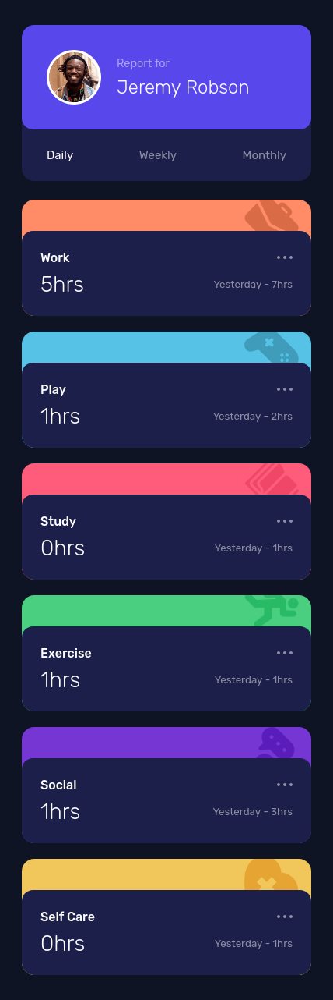
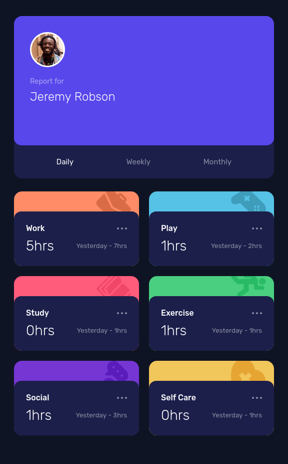
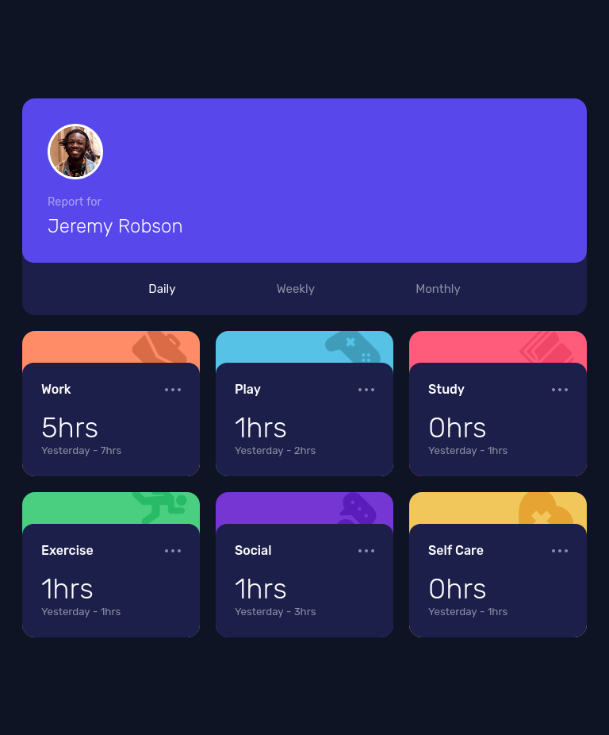
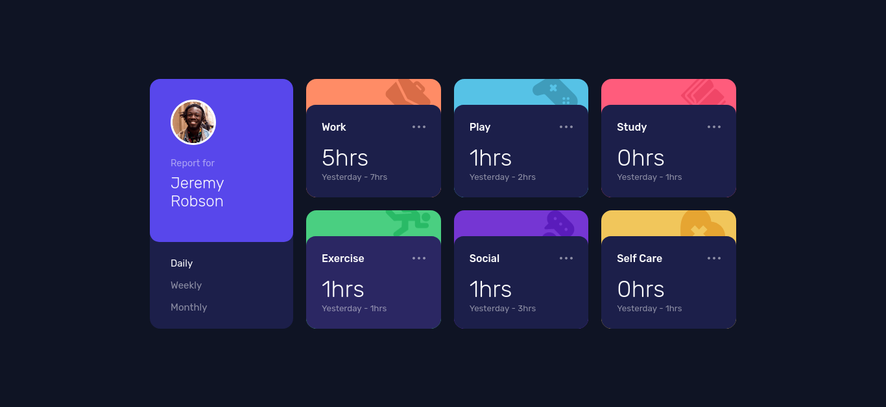

# Time Tracking Dashboard  
## Table of contents

- [Overview](#overview)
  - [The challenge](#the-challenge)
  - [Screenshot](#screenshot)
  - [Links](#links)
- [My process](#my-process)
  - [Built with](#built-with)
  - [What I learned](#what-i-learned)
- [Acknowledgments](#acknowledgments)
## Overview
### The challenge

Users should be able to:

- View the optimal layout for the site depending on their device's screen size
- See hover states for all interactive elements on the page
- Switch between viewing Daily, Weekly, and Monthly stats

### Screenshot

  



### Links

- Solution URL: [Solution](https://github.com/eldynmohammad/time-tracking-dashboard/)
- Live Site URL: [Live site](https://eldynmohammad.github.io/time-tracking-dashboard/)

## My process

### Built with

- Semantic HTML5 markup
- CSS custom properties
- Flexbox
- CSS Grid
- Javascript
- Mobile-first workflow

### What I learned

Thanks to Google now I know how to call data.json and to [Kessyblaise1](https://github.com/Kessyblaise1/time-tracking-dashboard-main/) for his code to change the content. To change the content he use click function and then using map. I modified the code so that more dynamic.

```js
function linkAction() {
	periodical.forEach(per => per.classList.remove('active-text'))
	this.classList.add('active-text')
	const text = this.text;
	const period = text.toLowerCase();
	fetch('assets/js/data.json')
		.then(function (response) {
			return response.json()
		})
		.then(function (data) {
			loadData(data, period)
		})

	function loadData(data, a) {
		details.forEach(d => d.innerHTML = `
            ${data.map(function (card) {
			return `
			<div class="card ${card.title.toLowerCase().split(' ').join('-')} activities__content">
				<div class="activities__details card__inside">
					<div class="activities__details-top flex">
						<div class="activities__name" id="activities-title-work">${card.title}</div>
						<div class="three-dots flex">
							<span></span>
							<span></span>
							<span></span>
						</div>
					</div>
					<div class="activities__details-bottom flex">
						<p class="activities__current" id="activities-current">${a == 'daily' ? `${card.timeframes.daily.current}hrs` : a == 'weekly' ? `${card.timeframes.weekly.current}hrs` : `${card.timeframes.monthly.current}hrs`}</p >
						<p class="activities__previous" id="activities-last">${a == 'daily' ? 'Yesterday' : a == 'weekly' ? 'Last Week' : 'Last Month'} - <span class="previous">${a == 'daily' ? `${card.timeframes.daily.previous}hrs` : a == 'weekly' ? `${card.timeframes.weekly.previous}hrs` : `${card.timeframes.monthly.previous}hrs`}</span></p>
					</div >
				</div>
			</div>
			`
		}).join("")}
            `)
	}
}
periodical.forEach(p => p.addEventListener('click', linkAction))
```  

## Acknowledgments
Thank you to [Kessyblaise1](https://github.com/Kessyblaise1/time-tracking-dashboard-main/blob/main/main.js). Without his code I might not found the solution.
